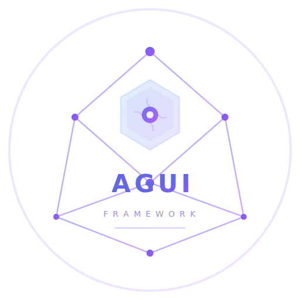

# AGUI Framework

<p align="center">
  
</p>

A **TypeScript SDK** for building AI agent-powered applications. AGUI Framework provides a complete toolkit for creating, orchestrating, and deploying LLM-based agents with multi-provider support, real-time streaming, state management, persistence, and the AG-UI protocol for frontend communication.

---

## Features

<div class="grid cards" markdown>

-   :material-robot: **Agent Runtime** -- Central orchestrator for LLM interactions with `run`/`stream`/`resume` execution modes, tool execution, middleware pipeline, and event emission.
-   :material-cloud: **Multi-LLM Providers** -- OpenAI, Anthropic, Ollama, and Fireworks support through a common `BaseLLMProvider` abstraction.
-   :material-wave: **Real-Time Streaming** -- `AsyncGenerator`-based streaming with event callbacks and SSE encoding.
-   :material-publish: **Event System** -- Publish/subscribe `EventBus` with history, compaction, and piping.
-   :material-database: **State Management** -- Thread-isolated `SharedState` with versioning, diffing, merging, conflict resolution, and agent-accessible tools.
-   :material-brain: **Long-Term Memory** -- Optional RDF-based semantic store (Oxigraph) with self-managing `remember`/`recall`/`forget` tools.
-   :material-cable-data: **AG-UI Protocol** -- Full SSE-based protocol encoding, validation, and event compaction.
-   :material-puzzle: **MCP Integration** -- Connect to any MCP-compatible tool server via stdio or streamable HTTP; tools are auto-discovered and registered.
-   :material-account-group: **Multi-Agent Patterns** -- Delegation, cyclic handoff, capability routing, and directed graph workflows.
-   :material-layers: **Middleware Pipeline** -- Composable event interception and transformation.
-   :material-database: **Persistence** -- Memory, Redis, and Postgres thread stores.
-   :material-server: **HTTP/WebSocket Server** -- Express-based `AguiServer` with REST API, SSE streaming, and WebSocket agent communication.
-   :material-book: **Model Catalog** -- 44+ models across 4 providers with pricing, context windows, and capabilities.
-   :material-currency-usd: **Cost & Usage Tracking** -- Per-run token usage, cost calculation, cumulative thread cost, budget limits.
-   :material-react: **React Hooks** -- `useStream`, `useThread`, `useInterrupts`, `useCoAgent`, `useWebSocket`, `useAgentState`, `useRunningAgents`, `useLiveState`, `useGeneratedUI`, and more.
-   :material-wand: **Generative User Interfaces** -- Agents dynamically generate forms, wizards, and interactive UIs at runtime without custom tool renderers.
-   :material-shield-check: **Type Safety** -- Full TypeScript with strict types across all modules.

</div>

---

## Quick Start

```bash
npm install agui-framework
```

Requires Node.js 18+.

### 1. Basic Agent

```typescript
import { Agent } from "agui-framework";

const agent = new Agent({
  model: "gpt-4o",
  provider: "openai",
  instructions: "You are a helpful assistant.",
});

const response = await agent.run("What is the capital of France?");
console.log(response);
```

Set `OPENAI_API_KEY` in your environment.

### 2. Streaming Response

```typescript
import { Agent } from "agui-framework";

const agent = new Agent({
  model: "gpt-4o",
  provider: "openai",
  instructions: "Tell a detailed story.",
});

for await (const chunk of agent.stream("Tell me about space exploration")) {
  process.stdout.write(chunk);
}
```

### 3. Agent with Tools

```typescript
import { Agent } from "agui-framework";
import type { ToolConfig } from "agui-framework";

const weatherTool: ToolConfig = {
  name: "get_weather",
  description: "Get current weather for a city",
  parameters: {
    type: "object",
    properties: { city: { type: "string", description: "City name" } },
    required: ["city"],
  },
  handler: async ({ city }) => ({ city, temperature: 22, conditions: "sunny" }),
};

const agent = new Agent({
  model: "gpt-4o",
  provider: "openai",
  instructions: "Use the weather tool when asked about weather.",
  tools: [weatherTool],
});

const response = await agent.run("What is the weather in Paris?");
console.log(response);
```

---

## Where to Go Next

| Section | Description |
|---------|-------------|
| [Getting Started](getting-started.md) | Installation, prerequisites, first agent, configuration |
| [Agent](agents.md) | Agent class deep dive: config, tools, execution modes |
| [Events](events.md) | EventBus API, event types, subscriptions |
| [State Management](state-management.md) | SharedState, StateManager, thread isolation |
| [Providers](providers.md) | Provider architecture, custom providers |
| [Architecture](architecture.md) | Module relationships, data flow, extension points |
| [Multi-Agent Patterns](multi-agent.md) | Delegation, handoff, graph workflows |
| [Server](server.md) | HTTP/WebSocket server setup and API |
| [Generative UI](generative-ui.md) | AI-generated interfaces — forms, wizards, and interactive UIs at runtime |
| [API Reference](api-reference.md) | Complete API reference organized by module |
